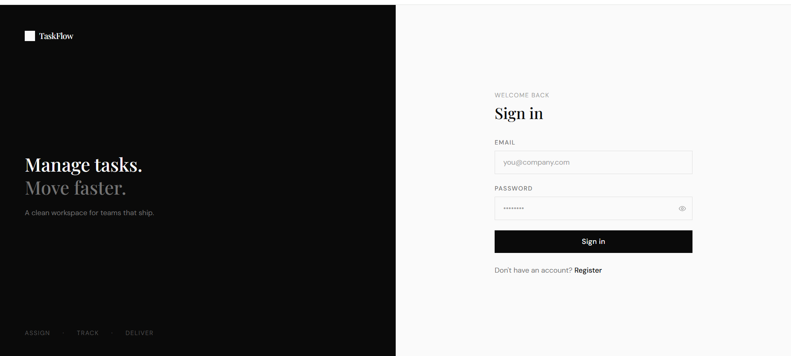
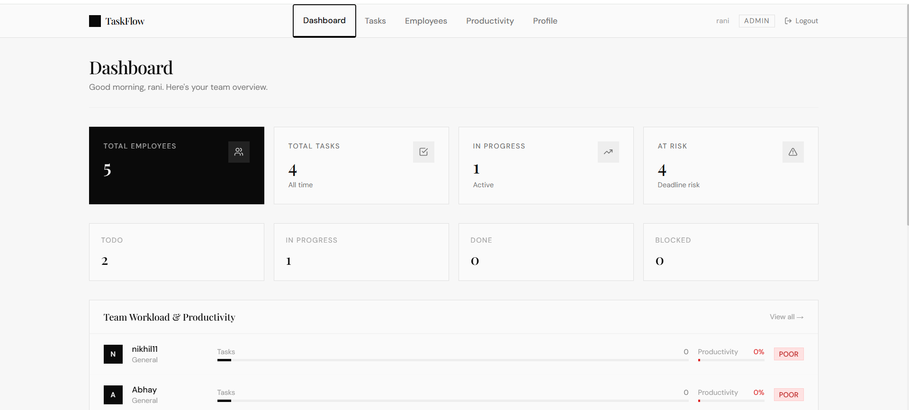
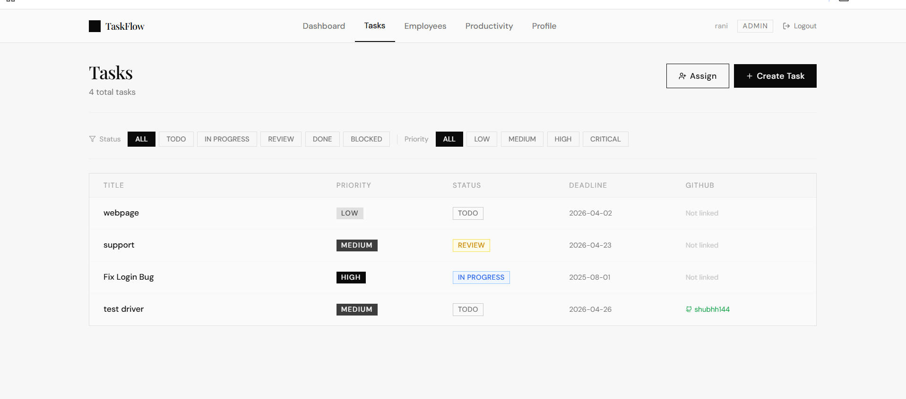
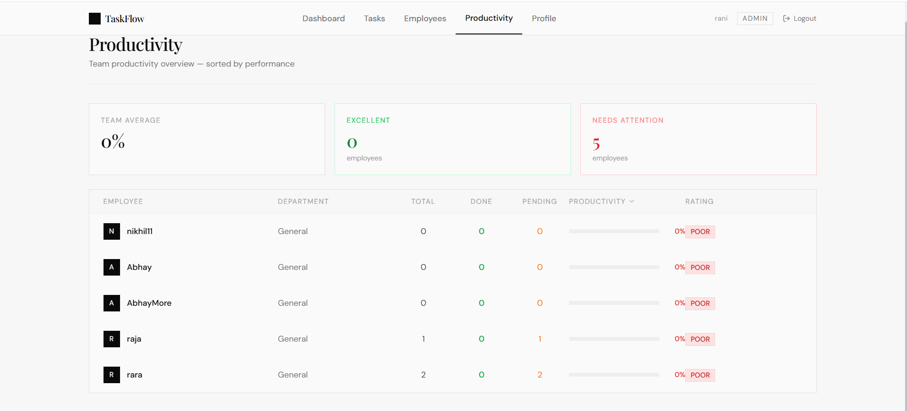
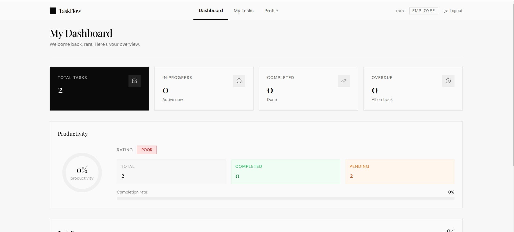
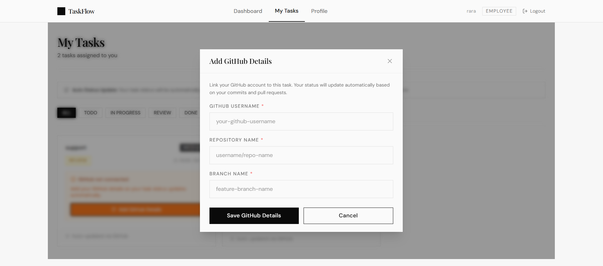

# 🏢 Employee Workload Management System

A full-stack web application for managing employee workload, tracking productivity, and automating task status updates via GitHub integration.

---

## 📸 Screenshots

> Add screenshots in `/screenshots` folder and update paths below

| Page | Preview |
|------|---------|
| Login Page |  |
| Manager Dashboard |  |
| Tasks Page |  |
| Employees Page |  |
| Productivity Page |  |
| Employee Dashboard |  |
| My Tasks |  |

---

## 🚀 Features

### Manager (Admin)
- 📊 Dashboard with total employees, tasks, workload overview
- ✅ Create and assign tasks to employees
- 👥 View all employees with workload and capacity
- 📈 Productivity report for all employees
- ⚠️ Deadline risk assessment

### Employee
- 🏠 Personal dashboard with health score
- 📋 View assigned tasks
- 🔗 Add GitHub details to tasks
- 🤖 Automatic task status updates via GitHub activity

### GitHub Integration
- 🔄 Scheduler runs every 5 minutes
- 📝 Commit detected → `IN_PROGRESS`
- 🔀 Pull Request opened → `REVIEW`
- ✅ PR merged → `DONE`
- 🚫 Fake commits filtered (files + lines threshold)

---

## 🛠️ Tech Stack

### Backend
| Technology | Version | Purpose |
|-----------|---------|---------|
| Java | 21 | Programming Language |
| Spring Boot | 3.3.5 | Backend Framework |
| Spring Security | included | Authentication & Authorization |
| PostgreSQL | 17.7 | Database |
| Hibernate/JPA | 6.5.3 | ORM |
| JWT (jjwt) | 0.11.5 | Token Authentication |
| Lombok | 1.18.36 | Code Reduction |
| Maven | 3.9.14 | Build Tool |

### Frontend
| Technology | Version | Purpose |
|-----------|---------|---------|
| React | Latest | UI Framework |
| Vite | Latest | Build Tool |
| Tailwind CSS | Latest | Styling |
| Axios | Latest | HTTP Client |
| React Router | v6 | Routing |

---

## 📁 Project Structure

```
Employee-Workload-Management/
├── workload/                    ← Spring Boot Backend
│   ├── src/main/java/com/shubham/workload/
│   │   ├── controller/
│   │   │   ├── AuthController.java
│   │   │   ├── TaskController.java
│   │   │   ├── EmployeeController.java
│   │   │   ├── WorkloadController.java
│   │   │   ├── ProductivityController.java
│   │   │   ├── DeadlineRiskController.java
│   │   │   ├── DashboardController.java
│   │   │   ├── GitHubController.java
│   │   │   └── GlobalExceptionHandler.java
│   │   ├── service/
│   │   │   ├── AuthService.java
│   │   │   ├── TaskService.java
│   │   │   ├── EmployeeService.java
│   │   │   ├── WorkloadService.java
│   │   │   ├── ProductivityService.java
│   │   │   ├── DeadlineRiskService.java
│   │   │   ├── DashboardService.java
│   │   │   └── GitHubService.java
│   │   ├── repository/
│   │   ├── model/
│   │   ├── security/
│   │   │   ├── SecurityConfig.java
│   │   │   ├── JwtUtil.java
│   │   │   └── JwtAuthFilter.java
│   │   └── scheduler/
│   │       └── GitHubScheduler.java
│   └── src/main/resources/
│       └── application.properties
│
└── taskflow/                    ← React Frontend
    └── src/
        ├── App.jsx
        ├── context/AuthContext.jsx
        ├── routes/ProtectedRoute.jsx
        ├── services/api.js
        ├── pages/
        │   ├── auth/
        │   ├── manager/
        │   └── employee/
        └── components/common/
```

---

## ⚙️ Setup & Installation

### Prerequisites
- Java 21
- Node.js 18+
- PostgreSQL 17
- Maven 3.9+
- GitHub Personal Access Token

---

### 🗄️ Database Setup

1. Open pgAdmin or psql
2. Create database:
```sql
CREATE DATABASE workload_db;
```

---

### 🔧 Backend Setup

1. Clone repository:
```bash
git clone https://github.com/your-username/Employee-Workload-Management.git
cd Employee-Workload-Management/workload
```

2. Configure `application.properties`:
```properties
spring.application.name=workload
spring.datasource.url=jdbc:postgresql://localhost:5432/workload_db
spring.datasource.username=postgres
spring.datasource.password=your_password

spring.jpa.hibernate.ddl-auto=update
spring.jpa.show-sql=true
spring.jpa.properties.hibernate.dialect=org.hibernate.dialect.PostgreSQLDialect

jwt.secret=404E635266556A586E3272357538782F413F4428472B4B6250645367566B59703373367639792F423F45
jwt.expiration=86400000

github.token=ghp_your_github_token_here
github.api.url=https://api.github.com
```

3. Run backend:
```bash
./mvnw spring-boot:run
```

Backend runs on: `http://localhost:8080`

---

### 🎨 Frontend Setup

1. Navigate to frontend:
```bash
cd ../taskflow
```

2. Install dependencies:
```bash
npm install
```

3. Run frontend:
```bash
npm run dev
```

Frontend runs on: `http://localhost:5173`

---

## 🔑 API Endpoints

### Authentication
```
POST /auth/register    → Register new user
POST /auth/login       → Login and get JWT token
```

### Tasks
```
GET  /task/all                     → Get all tasks
POST /task/create                  → Create new task
POST /task/assign                  → Assign task to employee
PUT  /task/{id}/github-details     → Add GitHub details
GET  /github/check/{id}            → Manual GitHub status check
```

### Employees
```
GET /employee/all                  → All employees
GET /employee/{id}/tasks           → Employee tasks
GET /employee/{id}/workload        → Workload data
GET /employee/{id}/productivity    → Productivity data
```

### Dashboard
```
GET /dashboard/admin               → Manager dashboard
GET /dashboard/{employeeId}        → Employee dashboard
```

### Risk
```
GET /tasks/deadline-risk           → Deadline risk report
```

---

## 📊 Formulas & Calculations

### Workload
```
totalHours = taskCount × 8 hours
utilization = (totalHours / capacity) × 100

Status:
  ≥ 90% → OVERLOADED
  ≥ 60% → OPTIMAL
  ≥ 30% → MODERATE
  < 30%  → UNDERUTILIZED
```

### Productivity
```
productivity = (completedTasks / totalTasks) × 100

Rating:
  ≥ 80% → EXCELLENT
  ≥ 60% → GOOD
  ≥ 40% → AVERAGE
  ≥ 20% → BELOW_AVERAGE
  < 20%  → POOR
```

### Deadline Risk
```
daysRemaining = deadline - today

< 0 days  → CRITICAL (overdue)
≤ 2 days  → HIGH
> 2 days  → LOW
```

### Health Score
```
riskPenalty = (criticalTasks × 15) + (highRiskTasks × 5)
healthScore = ((productivity + (100 - utilization)) / 2) - riskPenalty

≥ 75 → HEALTHY
≥ 50 → MODERATE
≥ 25 → AT_RISK
< 25  → CRITICAL
```

---

## 🤖 GitHub Integration

### How it works:
1. Manager creates and assigns task
2. Employee adds GitHub details to task
3. Scheduler checks GitHub every 5 minutes
4. Task status auto-updates based on activity

### Status Update Logic:
```
PR Merged  → DONE
PR Open    → REVIEW
Commit     → IN_PROGRESS (valid if files≥1, lines≥1, <24hrs)
```

### Manual trigger:
```
GET /github/check/{taskId}
```


---

## 🔐 Security

- **JWT Authentication**: Stateless token-based auth (24hr expiry)
- **BCrypt**: Password encryption with auto salt
- **Spring Security**: Role-based access control
- **CORS**: Configured for React frontend
- **Email Normalization**: Case-insensitive email handling

---

## 📝 User Roles

### ADMIN (Manager)
- Create tasks
- Assign tasks to employees
- View all employees and their workload
- Access productivity reports
- View deadline risks

### EMPLOYEE
- View assigned tasks
- Add GitHub details to tasks
- View personal dashboard and productivity

---

## 📄 License

This project is for educational purposes.

---

## 🙏 Acknowledgments

- Spring Boot Documentation
- React Documentation
- GitHub REST API Documentation
- Tailwind CSS Documentation
